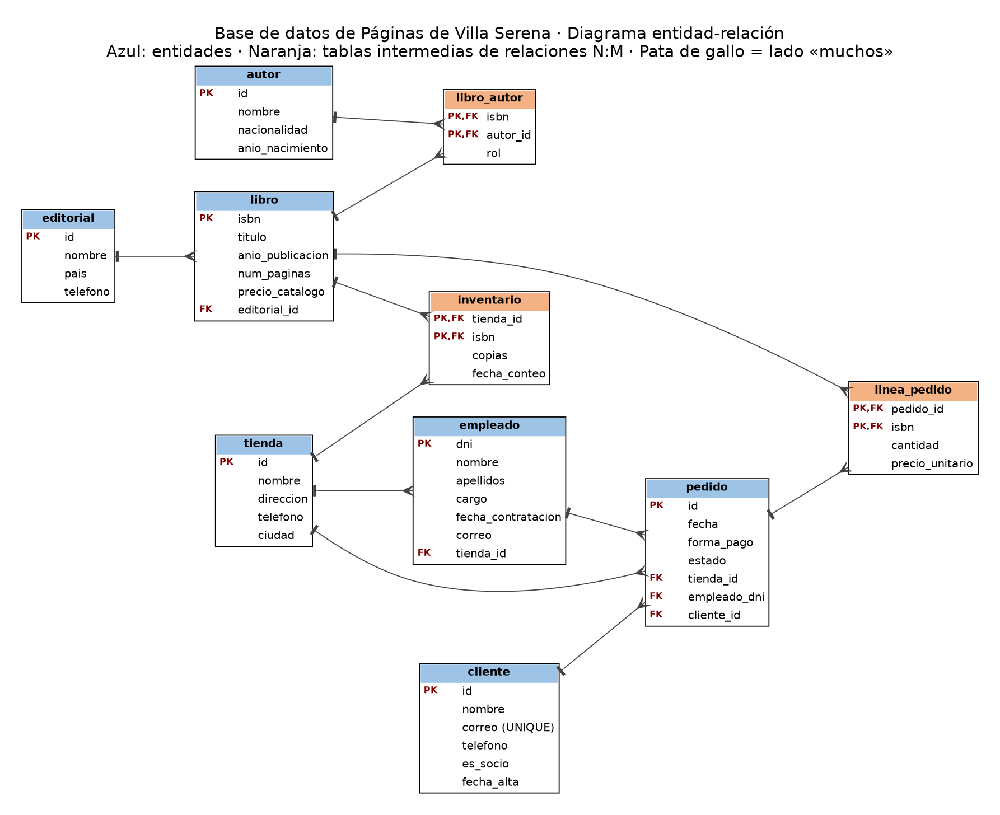

# Base de datos de Páginas de Villa Serena

> **Trabajo Nº1 · Documentación del sistema** · Fase 3: diseño y documentación de la base de datos
> **Criterio RA6 d)**: se ha documentado la estructura de la información persistente.
> **Grupo:** _(nombres de los integrantes)_

**Archivos de la entrega:** este documento (`.md`), [`schema.sql`](schema.sql) y la imagen [`docs/imagenes/diagrama_er.png`](docs/imagenes/diagrama_er.png).

## Índice

1. [Resumen del caso](#1-resumen-del-caso)
2. [Análisis del caso](#2-análisis-del-caso)
3. [Reglas de negocio](#3-reglas-de-negocio)
4. [Diagrama entidad-relación](#4-diagrama-entidad-relación)
5. [Modelo lógico](#5-modelo-lógico)
6. [Script SQL (schema.sql)](#6-script-sql-schemasql)
7. [Diccionario de datos](#7-diccionario-de-datos)
8. [Decisiones de diseño](#8-decisiones-de-diseño)
9. [Datos de prueba](#9-datos-de-prueba)
10. [Consultas de prueba](#10-consultas-de-prueba)
11. [Limitaciones y mejoras futuras](#11-limitaciones-y-mejoras-futuras)

## 1. Resumen del caso

Páginas de Villa Serena es una librería con veinte años de historia que hoy cuenta con tres tiendas: Centro, Ribera (en el pueblo vecino de Aldeaverde) y Universidad. Su dueña, Elena Ruiz, vende libros del catálogo propio, cada uno con su editorial y sus autores, y tiene empleados repartidos por las tiendas y clientes, algunos de ellos socios con descuentos.

El problema de hoy es que cada tienda lleva su propia hoja de cálculo y las cifras no coinciden con la realidad: un cliente pidió un libro en Centro, la hoja decía que había tres copias y en realidad estaban en Universidad. Además, las hojas repiten datos (la editorial en cada fila), meten varios autores en una sola celda y guardan un único «stock» por libro, sin distinguir tienda. Y si el precio de un libro cambia, los pedidos antiguos dejan de cuadrar con lo que se cobró.

Elena necesita una base de datos que le diga **en todo momento cuántas copias de cada libro hay en cada tienda y cuándo se contaron**, que registre los **pedidos** con lo que realmente se cobró en cada uno, y que permita responder preguntas de negocio como el libro más vendido de cada tienda, lo facturado por tienda o los clientes más habituales.

---

## 2. Análisis del caso

Para cada elemento se indica entre paréntesis la sección del caso de la que sale (§1 a §8).

### 2.1 Entidades y atributos

| Entidad | Atributos encontrados | Fragmento del caso |
|---|---|---|
| Tienda | nombre, dirección, teléfono, ciudad | §1: «su nombre, su dirección, su teléfono y su ciudad» |
| Libro | ISBN, título, año de publicación, número de páginas, precio de catálogo | §2: «se identifica por su ISBN… título, año… páginas… precio de catálogo» |
| Editorial | nombre, país, teléfono | §2: «su nombre, el país y un teléfono de contacto» |
| Autor | nombre, nacionalidad, año de nacimiento | §2: «el nombre, la nacionalidad y el año de nacimiento» |
| Empleado | DNI, nombre, apellidos, cargo, fecha de contratación, correo | §4: «el DNI, el nombre y los apellidos, el cargo… la fecha de contratación y el correo» |
| Cliente | nombre, correo (único), teléfono (opcional), si es socio, fecha de alta | §5: «nombre completo, correo… teléfono (opcional) y fecha de alta» |
| Pedido | número, fecha, forma de pago, estado | §6: «Tiene una fecha, una forma de pago… y un estado» |

Además aparecen **datos que pertenecen a una relación** y no a una entidad, y por eso acaban en tablas intermedias:

| Dato | Pertenece a la relación | Fragmento del caso |
|---|---|---|
| Rol del autor (principal o colaborador) | Libro – Autor | §2: «distinguir si el autor es principal o colaborador» |
| Copias y fecha del último recuento | Tienda – Libro | §3: «cuántas copias hay, y cuándo se contó por última vez» |
| Cantidad y precio realmente cobrado | Pedido – Libro | §6: «de cada uno me interesa la cantidad… lo que realmente se cobró» |

### 2.2 Relaciones

| Relación | Cardinalidad | Razonamiento |
|---|---|---|
| Editorial – Libro | 1:N | Una editorial publica muchos libros; un libro lo publica una sola editorial (§2). |
| Libro – Autor | N:M | Un libro puede tener dos o tres autores y un autor tiene muchos libros (§2). Se resuelve con `libro_autor`, que guarda el rol. |
| Tienda – Libro | N:M | Una tienda tiene muchos libros y un libro puede estar en varias tiendas, o en ninguna (§3). Se resuelve con `inventario`, que guarda copias y fecha de conteo. |
| Tienda – Empleado | 1:N | En cada tienda trabajan varios empleados; cada empleado trabaja en una sola tienda (§4). |
| Tienda – Pedido | 1:N | Un pedido se hace siempre en una tienda; una tienda tiene muchos pedidos (§6). |
| Empleado – Pedido | 1:N | Un pedido lo atiende un empleado; un empleado atiende muchos pedidos (§6). |
| Cliente – Pedido | 1:N | Un pedido lo compra un cliente; un cliente puede hacer muchos pedidos (§6). |
| Pedido – Libro | N:M | Un pedido lleva varios libros distintos y un libro aparece en muchos pedidos (§6). Se resuelve con `linea_pedido`, que guarda cantidad y precio cobrado. |

---

### 2.3 Datos descartados

| Dato | Motivo |
|---|---|
| Total del ticket (50,50 €) y subtotal de cada línea (24,00 €) | Se pueden **calcular** con `cantidad × precio_unitario`. Guardarlos permitiría que un total no cuadre con sus líneas. |
| Columna «stock» por libro (hoja de cálculo, §3) | Es justo lo que falla hoy: no distingue tienda. Se sustituye por `inventario`. |
| Celda «Cortázar / Borges» (§8) | Dos valores en una celda; se descompone en dos filas de `libro_autor`. |
| Editorial repetida en cada fila de la hoja (§8) | Dato repetido; se guarda una vez en `editorial` y se referencia. |
| Nombre y cargo del empleado dentro del ticket («Marta López (cajera)») | Ya vive en `empleado`; el pedido solo guarda la referencia. |
| Dirección y teléfono de la tienda dentro del ticket | Ya viven en `tienda`. |
| Historial de cambios de tienda de un empleado | Elena dice que no le importa (§4). |
| Distinción «socio / no socio» como dos entidades | Son la misma persona con distinto estado; se modela con un único `cliente` (ver decisión 5). |

---


## 3. Reglas de negocio

1. Una editorial publica muchos libros; cada libro lo publica una única editorial.
2. Cada libro se identifica por su ISBN, que tiene 13 cifras.
3. Un libro puede tener varios autores y un autor puede tener varios libros; en cada libro cada autor figura como principal o como colaborador.
4. Cada tienda guarda, para cada libro que tiene, el número de copias y la fecha del último recuento; un libro que no está en una tienda no aparece en su inventario.
5. El número de copias de un libro en una tienda no puede ser negativo.
6. Cada empleado trabaja en una única tienda y su cargo es librero, cajero o encargado.
7. Un cliente se identifica por su correo electrónico, que no puede repetirse; el teléfono es opcional.
8. Un socio es un cliente con fecha de alta; quien no es socio no tiene fecha de alta.
9. Un pedido se hace siempre en una única tienda, lo atiende un único empleado y lo compra un único cliente.
10. Un pedido tiene fecha, una forma de pago (efectivo, tarjeta o bizum) y un estado (preparado, entregado o cancelado).
11. Un pedido puede llevar varios libros distintos, y de cada uno se guarda la cantidad, que debe ser mayor que cero.
12. Cada línea de pedido guarda el precio que realmente se cobró por copia, que no puede ser negativo y no cambia aunque cambie el precio de catálogo.
13. El total de un pedido no se guarda: se calcula sumando `cantidad × precio_unitario` de sus líneas.
14. Cuando un empleado cambia de tienda, figura en la nueva y no se conserva el historial.

---

## 4. Diagrama entidad-relación



El diagrama tiene **10 tablas**: 7 entidades (en azul) y 3 tablas intermedias de relaciones N:M (en naranja). En cada línea, la marca simple está en el lado «uno» y la pata de gallo en el lado «muchos». Las N:M no se dibujan directamente: se ven como dos relaciones 1:N que parten de la tabla intermedia.

### Tabla de relaciones

| Relación | Tipo | Cómo se resuelve |
|---|---|---|
| editorial – libro | 1:N | `libro.editorial_id` |
| libro – autor | N:M | Tabla intermedia `libro_autor` (con `rol`) |
| tienda – libro | N:M | Tabla intermedia `inventario` (con `copias` y `fecha_conteo`) |
| tienda – empleado | 1:N | `empleado.tienda_id` |
| tienda – pedido | 1:N | `pedido.tienda_id` |
| empleado – pedido | 1:N | `pedido.empleado_dni` |
| cliente – pedido | 1:N | `pedido.cliente_id` |
| pedido – libro | N:M | Tabla intermedia `linea_pedido` (con `cantidad` y `precio_unitario`) |

---

## 5. Modelo lógico

Las claves foráneas están en el lado «muchos» de cada relación 1:N. En las tablas intermedias, la clave primaria es la pareja de claves foráneas.

**`editorial`**

| Columna | Clave | Referencia |
|---|---|---|
| `id` | PK |  |
| `nombre` |  |  |
| `pais` |  |  |
| `telefono` |  |  |

**`autor`**

| Columna | Clave | Referencia |
|---|---|---|
| `id` | PK |  |
| `nombre` |  |  |
| `nacionalidad` |  |  |
| `anio_nacimiento` |  |  |

**`libro`**

| Columna | Clave | Referencia |
|---|---|---|
| `isbn` | PK |  |
| `titulo` |  |  |
| `anio_publicacion` |  |  |
| `num_paginas` |  |  |
| `precio_catalogo` |  |  |
| `editorial_id` | FK | `editorial.id` |

**`libro_autor`**

| Columna | Clave | Referencia |
|---|---|---|
| `isbn` | PK, FK | `libro.isbn` |
| `autor_id` | PK, FK | `autor.id` |
| `rol` |  |  |

**`tienda`**

| Columna | Clave | Referencia |
|---|---|---|
| `id` | PK |  |
| `nombre` |  |  |
| `direccion` |  |  |
| `telefono` |  |  |
| `ciudad` |  |  |

**`inventario`**

| Columna | Clave | Referencia |
|---|---|---|
| `tienda_id` | PK, FK | `tienda.id` |
| `isbn` | PK, FK | `libro.isbn` |
| `copias` |  |  |
| `fecha_conteo` |  |  |

**`empleado`**

| Columna | Clave | Referencia |
|---|---|---|
| `dni` | PK |  |
| `nombre` |  |  |
| `apellidos` |  |  |
| `cargo` |  |  |
| `fecha_contratacion` |  |  |
| `correo` |  |  |
| `tienda_id` | FK | `tienda.id` |

**`cliente`**

| Columna | Clave | Referencia |
|---|---|---|
| `id` | PK |  |
| `nombre` |  |  |
| `correo` |  |  |
| `telefono` |  |  |
| `es_socio` |  |  |
| `fecha_alta` |  |  |

**`pedido`**

| Columna | Clave | Referencia |
|---|---|---|
| `id` | PK |  |
| `fecha` |  |  |
| `forma_pago` |  |  |
| `estado` |  |  |
| `tienda_id` | FK | `tienda.id` |
| `empleado_dni` | FK | `empleado.dni` |
| `cliente_id` | FK | `cliente.id` |

**`linea_pedido`**

| Columna | Clave | Referencia |
|---|---|---|
| `pedido_id` | PK, FK | `pedido.id` |
| `isbn` | PK, FK | `libro.isbn` |
| `cantidad` |  |  |
| `precio_unitario` |  |  |

---

## 6. Script SQL (schema.sql)

El script completo (estructura y datos de prueba) está en [`schema.sql`](schema.sql). Se ha probado **desde cero en MySQL 8.0** sobre una base de datos vacía, sin errores. Requiere MySQL 8.0.16 o superior porque usa `CHECK`. A continuación, la parte de estructura; el orden de creación respeta las dependencias (primero las tablas a las que apuntan las claves foráneas).

```sql
DROP DATABASE IF EXISTS libreria;
CREATE DATABASE libreria CHARACTER SET utf8mb4 COLLATE utf8mb4_0900_ai_ci;
USE libreria;

CREATE TABLE editorial (
    id        INT          PRIMARY KEY AUTO_INCREMENT,
    nombre    VARCHAR(100) NOT NULL UNIQUE,
    pais      VARCHAR(60)  NOT NULL,
    telefono  VARCHAR(20)  NOT NULL
);

CREATE TABLE autor (
    id                INT          PRIMARY KEY AUTO_INCREMENT,
    nombre            VARCHAR(100) NOT NULL,
    nacionalidad      VARCHAR(60)  NOT NULL,
    anio_nacimiento   SMALLINT     NOT NULL,
    CHECK (anio_nacimiento BETWEEN 1000 AND 2100)
);

CREATE TABLE tienda (
    id         INT          PRIMARY KEY AUTO_INCREMENT,
    nombre     VARCHAR(50)  NOT NULL UNIQUE,
    direccion  VARCHAR(150) NOT NULL,
    telefono   VARCHAR(20)  NOT NULL,
    ciudad     VARCHAR(60)  NOT NULL
);

CREATE TABLE cliente (
    id          INT          PRIMARY KEY AUTO_INCREMENT,
    nombre      VARCHAR(100) NOT NULL,
    correo      VARCHAR(120) NOT NULL UNIQUE,
    telefono    VARCHAR(20)  NULL,
    es_socio    BOOLEAN      NOT NULL DEFAULT FALSE,
    fecha_alta  DATE         NULL,
    CHECK (es_socio = FALSE OR fecha_alta IS NOT NULL)
);

CREATE TABLE libro (
    isbn             CHAR(13)      PRIMARY KEY,
    titulo           VARCHAR(150)  NOT NULL,
    anio_publicacion SMALLINT      NOT NULL,
    num_paginas      SMALLINT      NOT NULL,
    precio_catalogo  DECIMAL(6,2)  NOT NULL,
    editorial_id     INT           NOT NULL,
    FOREIGN KEY (editorial_id) REFERENCES editorial(id),
    CHECK (isbn REGEXP '^[0-9]{13}$'),
    CHECK (num_paginas > 0),
    CHECK (precio_catalogo >= 0)
);

-- N:M libro - autor, con dato propio (rol del autor en ese libro)
CREATE TABLE libro_autor (
    isbn      CHAR(13) NOT NULL,
    autor_id  INT      NOT NULL,
    rol       ENUM('principal','colaborador') NOT NULL DEFAULT 'principal',
    PRIMARY KEY (isbn, autor_id),
    FOREIGN KEY (isbn)     REFERENCES libro(isbn),
    FOREIGN KEY (autor_id) REFERENCES autor(id)
);

-- N:M tienda - libro, con datos propios (copias y fecha del último recuento)
CREATE TABLE inventario (
    tienda_id       INT      NOT NULL,
    isbn            CHAR(13) NOT NULL,
    copias          INT      NOT NULL,
    fecha_conteo    DATE     NOT NULL,
    PRIMARY KEY (tienda_id, isbn),
    FOREIGN KEY (tienda_id) REFERENCES tienda(id),
    FOREIGN KEY (isbn)      REFERENCES libro(isbn),
    CHECK (copias >= 0)
);

CREATE TABLE empleado (
    dni                CHAR(9)      PRIMARY KEY,
    nombre             VARCHAR(50)  NOT NULL,
    apellidos          VARCHAR(100) NOT NULL,
    cargo              ENUM('librero','cajero','encargado') NOT NULL,
    fecha_contratacion DATE         NOT NULL,
    correo             VARCHAR(120) NOT NULL UNIQUE,
    tienda_id          INT          NOT NULL,
    FOREIGN KEY (tienda_id) REFERENCES tienda(id)
);

CREATE TABLE pedido (
    id            INT  PRIMARY KEY AUTO_INCREMENT,
    fecha         DATE NOT NULL,
    forma_pago    ENUM('efectivo','tarjeta','bizum')        NOT NULL,
    estado        ENUM('preparado','entregado','cancelado') NOT NULL DEFAULT 'preparado',
    tienda_id     INT      NOT NULL,
    empleado_dni  CHAR(9)  NOT NULL,
    cliente_id    INT      NOT NULL,
    FOREIGN KEY (tienda_id)    REFERENCES tienda(id),
    FOREIGN KEY (empleado_dni) REFERENCES empleado(dni),
    FOREIGN KEY (cliente_id)   REFERENCES cliente(id)
);

-- N:M pedido - libro, con datos propios (cantidad y precio realmente cobrado)
CREATE TABLE linea_pedido (
    pedido_id        INT          NOT NULL,
    isbn             CHAR(13)     NOT NULL,
    cantidad         INT          NOT NULL,
    precio_unitario  DECIMAL(6,2) NOT NULL,
    PRIMARY KEY (pedido_id, isbn),
    FOREIGN KEY (pedido_id) REFERENCES pedido(id),
    FOREIGN KEY (isbn)      REFERENCES libro(isbn),
    CHECK (cantidad > 0),
    CHECK (precio_unitario >= 0)
);
```

---

## 7. Diccionario de datos

#### `editorial`

Editorial que publica libros y a la que se hacen los pedidos de reposición (§2).

| Columna | Tipo | Obligatorio | Descripción |
|---|---|:---:|---|
| `id` | `INT` | Sí | Identificador numérico asignado por MySQL (`AUTO_INCREMENT`). |
| `nombre` | `VARCHAR(100)` | Sí | Nombre comercial de la editorial. Único: no puede haber dos editoriales con el mismo nombre. |
| `pais` | `VARCHAR(60)` | Sí | País donde tiene su sede. |
| `telefono` | `VARCHAR(20)` | Sí | Teléfono de contacto para hacer pedidos. Es texto porque admite espacios y prefijo internacional. |

#### `autor`

Persona que escribe libros (§2).

| Columna | Tipo | Obligatorio | Descripción |
|---|---|:---:|---|
| `id` | `INT` | Sí | Identificador numérico del autor. |
| `nombre` | `VARCHAR(100)` | Sí | Nombre completo con el que se busca al autor (por ejemplo, «Julio Cortázar»). |
| `nacionalidad` | `VARCHAR(60)` | Sí | Nacionalidad del autor. |
| `anio_nacimiento` | `SMALLINT` | Sí | Año de nacimiento (solo el año, como pide el caso). Debe estar entre 1000 y 2100. |

#### `libro`

Título del catálogo, identificado por su ISBN (§2).

| Columna | Tipo | Obligatorio | Descripción |
|---|---|:---:|---|
| `isbn` | `CHAR(13)` | Sí | ISBN de 13 cifras. Longitud fija, solo dígitos (lo garantiza un `CHECK`). Se usa como clave porque ya es único en el mundo real. |
| `titulo` | `VARCHAR(150)` | Sí | Título del libro. |
| `anio_publicacion` | `SMALLINT` | Sí | Año de publicación de la edición del catálogo. |
| `num_paginas` | `SMALLINT` | Sí | Número de páginas. Debe ser mayor que 0. |
| `precio_catalogo` | `DECIMAL(6,2)` | Sí | Precio **actual** de venta en euros. Puede cambiar con el tiempo; lo que se cobró de verdad en cada venta está en `linea_pedido.precio_unitario`. No puede ser negativo. |
| `editorial_id` | `INT` | Sí | Editorial que publica el libro. Un libro tiene una sola editorial. |

#### `libro_autor`

Tabla intermedia N:M entre libro y autor (§2).

| Columna | Tipo | Obligatorio | Descripción |
|---|---|:---:|---|
| `isbn` | `CHAR(13)` | Sí | Libro del que se habla. Junto con `autor_id` forma la clave primaria. |
| `autor_id` | `INT` | Sí | Autor que participa en ese libro. |
| `rol` | `ENUM` | Sí | `principal` o `colaborador` (por ejemplo, quien hace el prólogo). Por defecto `principal`. |

#### `tienda`

Cada una de las tres librerías físicas (§1).

| Columna | Tipo | Obligatorio | Descripción |
|---|---|:---:|---|
| `id` | `INT` | Sí | Identificador numérico de la tienda. |
| `nombre` | `VARCHAR(50)` | Sí | Nombre de la tienda (Centro, Ribera, Universidad). Único. |
| `direccion` | `VARCHAR(150)` | Sí | Dirección postal del local. |
| `telefono` | `VARCHAR(20)` | Sí | Teléfono de la tienda, tal y como sale en el ticket. |
| `ciudad` | `VARCHAR(60)` | Sí | Localidad donde está la tienda (Ribera está en Aldeaverde). |

#### `inventario`

Tabla intermedia N:M entre tienda y libro: copias que hay de cada libro en cada tienda (§3).

| Columna | Tipo | Obligatorio | Descripción |
|---|---|:---:|---|
| `tienda_id` | `INT` | Sí | Tienda donde se cuentan las copias. |
| `isbn` | `CHAR(13)` | Sí | Libro contado. Si un libro no está en una tienda, simplemente no hay fila. |
| `copias` | `INT` | Sí | Número de copias en la estantería en el último recuento. Puede ser 0 (agotado), nunca negativo. |
| `fecha_conteo` | `DATE` | Sí | Día en que se contaron esas copias por última vez. |

#### `empleado`

Persona que trabaja en una tienda (§4).

| Columna | Tipo | Obligatorio | Descripción |
|---|---|:---:|---|
| `dni` | `CHAR(9)` | Sí | DNI con letra (8 cifras + letra). Identifica al empleado. |
| `nombre` | `VARCHAR(50)` | Sí | Nombre de pila. |
| `apellidos` | `VARCHAR(100)` | Sí | Apellidos. |
| `cargo` | `ENUM` | Sí | `librero`, `cajero` o `encargado`. |
| `fecha_contratacion` | `DATE` | Sí | Día en que fue contratado. |
| `correo` | `VARCHAR(120)` | Sí | Correo de trabajo. Único. |
| `tienda_id` | `INT` | Sí | Tienda donde trabaja. Es una sola; si cambia de tienda se actualiza este valor y no se guarda historial (§4). |

#### `cliente`

Persona que compra, sea socia o no (§5).

| Columna | Tipo | Obligatorio | Descripción |
|---|---|:---:|---|
| `id` | `INT` | Sí | Identificador numérico del cliente. |
| `nombre` | `VARCHAR(100)` | Sí | Nombre completo. |
| `correo` | `VARCHAR(120)` | Sí | Correo electrónico. Único; se usa para enviar avisos y novedades. |
| `telefono` | `VARCHAR(20)` | No | Teléfono, opcional (§5). |
| `es_socio` | `BOOLEAN` | Sí | `TRUE` si se ha dado de alta como socio (con descuentos). Por defecto `FALSE`. |
| `fecha_alta` | `DATE` | Solo socios | Día de alta como socio. Obligatoria si `es_socio` es `TRUE` y `NULL` para quien no es socio (lo garantiza un `CHECK`). |

#### `pedido`

Cabecera de una compra: un cliente, en una tienda, atendido por un empleado (§6).

| Columna | Tipo | Obligatorio | Descripción |
|---|---|:---:|---|
| `id` | `INT` | Sí | Número de pedido (el «Pedido nº» del ticket). |
| `fecha` | `DATE` | Sí | Día de la compra. |
| `forma_pago` | `ENUM` | Sí | `efectivo`, `tarjeta` o `bizum`. |
| `estado` | `ENUM` | Sí | `preparado`, `entregado` o `cancelado`. Por defecto `preparado`. |
| `tienda_id` | `INT` | Sí | Tienda donde se hace el pedido (siempre una). |
| `empleado_dni` | `CHAR(9)` | Sí | Empleado que atiende el pedido (siempre uno). |
| `cliente_id` | `INT` | Sí | Cliente que compra (siempre uno). |

#### `linea_pedido`

Tabla intermedia N:M entre pedido y libro: cada renglón del ticket (§6).

| Columna | Tipo | Obligatorio | Descripción |
|---|---|:---:|---|
| `pedido_id` | `INT` | Sí | Pedido al que pertenece la línea. |
| `isbn` | `CHAR(13)` | Sí | Libro vendido. Un libro aparece una sola vez por pedido; si se compran varias copias se sube `cantidad`. |
| `cantidad` | `INT` | Sí | Número de copias vendidas. Debe ser mayor que 0. |
| `precio_unitario` | `DECIMAL(6,2)` | Sí | Euros que se cobraron **por copia en el momento de la venta**. No cambia aunque el precio de catálogo suba después. No puede ser negativo. |

---
